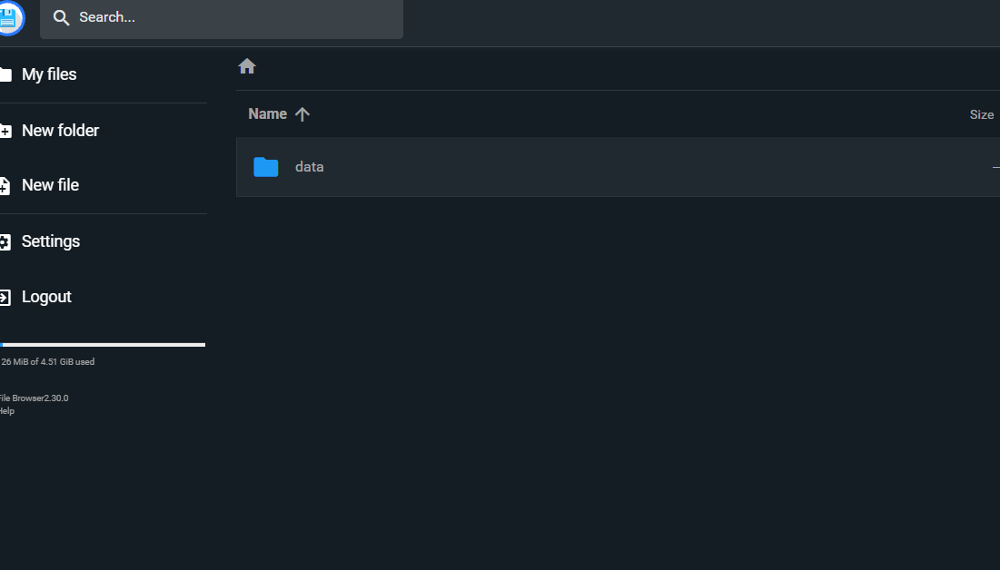

# Glass Explore

(c)2026 Jon Robinson. All Rights Reserved.

Glass Explore is a Dash web app for exploring architectural glazing products from the International Glazing Database (IGDB). It lets you pick glass products, build a simple insulated glass unit, and calculate optical and thermal properties using `pywincalc`.

The app currently focuses on the `Energy` page:

- search and filter IGDB glass products
- plot solar transmittance, visible transmittance, and colour spaces
- build a double-glazing unit with a coated lite, gas gap, and clear/ultraclear lite
- calculate U-value, SHGC or solar factor, visible transmittance, reflectance, and transmitted/reflected colours

## Requirements

- Python 3.11
- Poetry
- The data files under `data/`
- Microsoft Access Database Engine or Microsoft Access, only when converting a new IGDB `.mdb` file

Python 3.11 is currently used because `pywincalc` has had install/runtime issues with Python 3.12.

## Local Development

From the project root:

```powershell
poetry install
poetry run python glass_explore/app.py
```

The development server starts the Dash app. The root URL redirects to `/energy`.

For production-style local testing:

```powershell
poetry run python production.py
```

or with Gunicorn in a Linux-like environment:

```bash
poetry run gunicorn production:server
```

## Project Layout

- `glass_explore/app.py` - Dash app entry point
- `glass_explore/pages/energy.py` - Dash page registration and top-level page layout
- `glass_explore/energy_layout.py` - UI components for the Energy page
- `glass_explore/callbacks_energy.py` - Dash callbacks and user interaction logic
- `glass_explore/igdb.py` - IGDB SQLite/parquet lookup helpers
- `glass_explore/mywincalc.py` - `pywincalc` integration and calculation setup
- `glass_explore/optics.py` - converts IGDB spectral data into Optics-style temporary files
- `glass_explore/glass_model/` - glass build-up model and shareable `gstr` protocol
- `scripts/update_igdb.py` - IGDB conversion/parquet preparation script
- `data/standards/` - optical standard files used by `pywincalc`

## Data Files

The app expects these local files:

- `data/igdb.sqlite`
- `data/glass.parquet`
- `data/readable_glass.parquet`
- `data/standards/*`

`glass.parquet` is the main preprocessed glass table used for fast app loading. `igdb.sqlite` is used for detailed lookups such as spectral data, gas properties, and glazing properties.

## Updating IGDB Data

The IGDB is updated periodically by LBNL:

https://windows.lbl.gov/igdb-downloads

The downloaded `Glazing.mdb` file is password protected, so this project does not read that file directly. Instead, update the glass library inside LBNL WINDOW:

1. Open LBNL WINDOW.
2. Go to **Libraries > Glass**.
3. Use **Update IGDB**.
4. WINDOW writes an unprotected Access database, usually at:

```text
C:\Users\Public\LBNL\WINDOW7.8\w7.mdb
```

or, for older installations:

```text
C:\Users\Public\LBNL\WINDOW7.7\w7.mdb
```

To convert/update the local app data, use:

```powershell
poetry run python scripts/update_igdb.py
```

By default, the script currently creates the parquet glass table from the existing SQLite database. To convert a fresh Access database to SQLite, edit `scripts/update_igdb.py` and set:

```python
convert_access_file = True
```

When the update is working, the app's About modal should show the updated IGDB version.

## Railway Deployment

Railway is the current deployment target.

Deployment assumptions:

- Python 3.11
- Poetry dependencies from `pyproject.toml` and `poetry.lock`
- parquet files for fast app startup
- bundled parquet/SQLite data in `data/`
- optional SQLite/parquet data stored on a Railway volume

By default, Railway uses the bundled data deployed with the app. This keeps production in sync with repository updates. To force Railway to read from the mounted volume instead, set:

```text
GLASS_EXPLORE_DATA_SOURCE=volume
```

To prefer the volume when it is complete and fall back to bundled data otherwise, set:

```text
GLASS_EXPLORE_DATA_SOURCE=auto
```

When volume data is enabled, the app expects the mounted volume at:

```text
/igdb
```

The current production paths are built from:

```text
/igdb/storage/data/igdb.sqlite
/igdb/storage/data/glass.parquet
/igdb/storage/data/readable_glass.parquet
```

The diskcache keys include the `glass.parquet` file timestamp and size, so deploying updated bundled data will bypass stale cached graph/search data.

### Web volume data on Railway

To update the data files on Railway web-volume diconnent the Railway web-volume from main web service and connect to FileBrowser service. Go to FileBrowser remote URL and upload whole `data` directory as sub-directory in the remote root directory. 



## License

This project is licensed under AGPL-3.0. See `LICENSE`.
